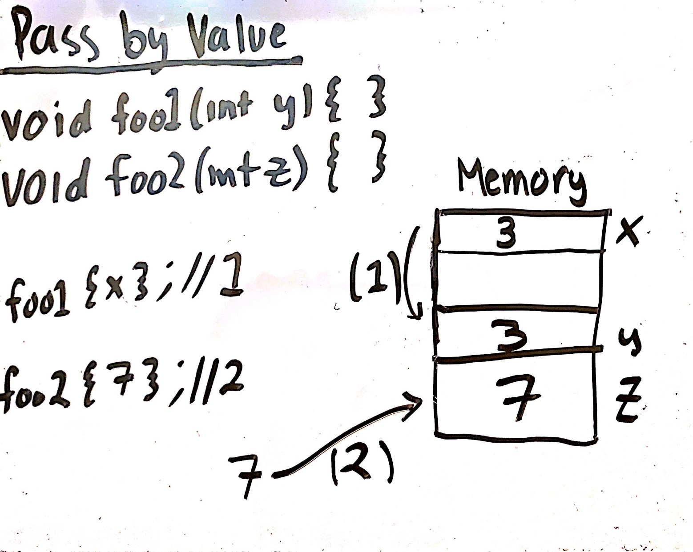
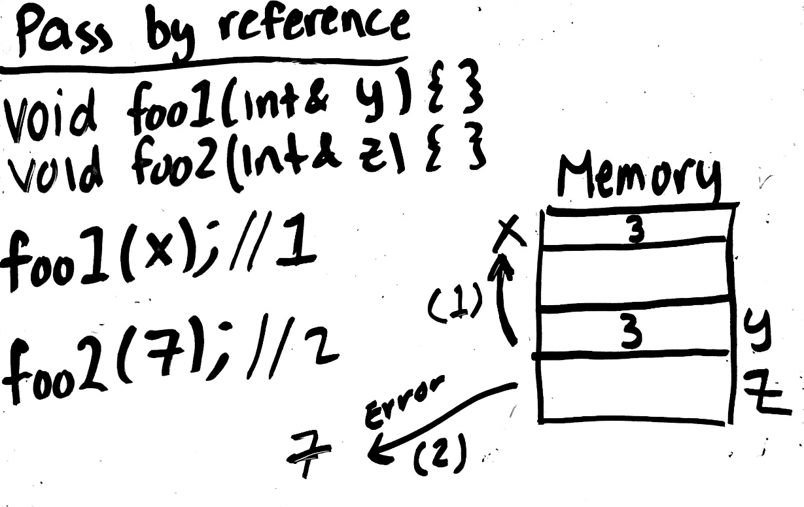

# Week 8

* [Quizlet](https://quizlet.com/549839803/cs10a-si-week-8-flash-cards/)

### Pass by Reference
---
* Passing by Reference is written in the form `<data type>& var` in the parameters of a function.
* Passing by Reference can only take a variable as an argument 
    * Passing in a literal will give an error
    * How to distinguish allowed arguments during function calls for **Pass by Reference** and **Pass by Value**:
        * Pass by reference has the word "Reference". When you refer to something, it needs to exist somewhere first. You can't refer to something that doesn't exist or hasn't been said before.
        * Pass by value has the word "Value". When you're getting a value from something, it doesn't have to exist anywhere in order for you to get it.
            * i.e. You can take something that someone had simply said to you, or you can take materials from someone or other things to make a copy of (this is plagarism btw, but it's an example)
    * How it works in memory (Pass by value vs Pass by reference):
        * 
        * When you pass by value, the function creates a new variable that is a copy of the value/varaible you placed in the argument.
        * In the figure above, the behavior in memory can be seen. foo1's call corresponds to (1) and foo2's call corresponds to (2)  
        * 
        * When you pass by reference, the function simply creates a nametag that will refer to what was passed in.
            * An even better understanding/explanation of how pass by reference works requires understanding *memory management* and *pointers*
                * Summing it up: Call by reference "points" at an address, variables have addresses, but literals do not. 
                * NOTE: using `const <type>& var` allows literals, this is because it will create a shadow copy of whatever was passed in to be used. But **DO NOT** use literals here since it is bad practice
        * In the figure above, the behavior in memory can be seen with variable and literal function call arguments. foo1's call corresponds to (1) and foo2's call corresponds to (2)
* Pass by Reference is slightly faster than Pass by Value (around 30x faster)
* Pass by Reference also allows you to "return" more than one value
* Pass by Reference allows you to modify your parameters directly, so be careful when choosing when to use pass by reference and when to pass by value and when to use a `const`

### Scope
---
* Scope is the visibility of variables and functions
    * The scope of a variable can be defined by which { } the variable is located in
        * functions / loops / branches have access to everything outside of it, but is not located in a parallel { }
        * functions / loops / branches do not have access to any { } within itself since it will exit that scope when returning to it
        * EX)
            ```c++
            int a = 0; // Anything out here ONLY has access to a

            { // This bracket has access to a and b
                int b = 0;
                {
                    int c = 0; // This bracket has access to a, b, c
                }
                {
                    int d = 0; // this bracket has access to a, b, d
                }
            }
            ```
        * **NOTE**: { } are NOT called scope operators, they're just called braces. Scope (resolution) operators are `::`, which is not important in CS10A.
    * **Global Variables** allow a variable to become usable in any function as long as it appears before it in the code
        * These variables are written outside any { }
        * EX) 
            ```c++
            void foo1() {} // This function DOES NOT have access to a   
            int a = 0; 
            void foo2() {} // This function DOES have access to a
            ```

### Preprocessors   
---
* Scans the file looking for lines beginning with #
* Most common preprocessor (that you have used a lot already) is `#include` which is used to add files or libraries to the code
    * `<>` is used to tell the preprocessor to include a library located in another "lib" folder
    * `""` is used to tell the processor to include a file located in the same folder
        * `"list.h"` tells the processor to look in the same folder as the main.cpp
        * `"headers/list.h"` tells the processor to look in a folder within the folder of the main.cpp, in this case it says to look in a "headers" folder

##### Types of Preprocessor Directives
###### Introduced in CS10A:
* `#include`
* `#define`
###### Introduced Later:
* `#ifndef`
* `#endif`
* `#pragma`

### Others
---
* Basic swapping requires a temp variable to hold the first variable being changed's value
* Writing a function like `void foo1();` is called a function declaration. The function is not defined yet, it just tells the program that the function exists and that it will be defined elsewhere
    * Useful in organizing your code when writing more functions (improves readability)
* Arrays and vectors are lists. The true benefit of pass by reference can be seen with lists.

### Coding Practice
---
**Instructions**:  
* Reading Code:  
    * The code will be written in a repl.it. Although you can run it, try not to as it defeats the purpose of practicing walkthroughs.
    * Follow the code and provide the correct output at the end
    * If you think there is an error, give the error, what type of error, and the fix for the error in addition to giving the correct output.
* Writing Code:
    * The Writing Code section is now split into different difficulties, each will take you to repl.it. Fork it and the problems shall be yours. Try your best and ask others for help if you need to.
* Difficulties (this is also now updated in the Guidelines in the README):
    * **Basic** - Simple problems similar to what you see in the Zybooks pages and may see in exams
    * **Moderate** - Problems that require a little more thinking. These may feel around the difficulty of challenge activities
    * **Difficult** - Problems that are generally classified as Hard. These most resemble lab difficulty
    * **EXTRA** - Problems that focus on thinking out of the box. These can vary in difficulty as the focus isn't the hardness, but rather the use of what you've learned

##### Reading Code
* [Basic]()
* [Difficult]()

##### Writing Code
* [Basic](https://repl.it/@PikaSannnnn/w8b#main.cpp)
* [Moderate](https://repl.it/@PikaSannnnn/w8m#main.cpp)
* [Difficult](https://repl.it/@PikaSannnnn/w8d#main.cpp)
* [EXTRA](https://repl.it/@PikaSannnnn/w8E#main.cpp)