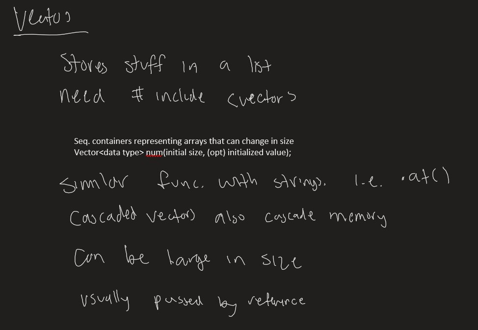
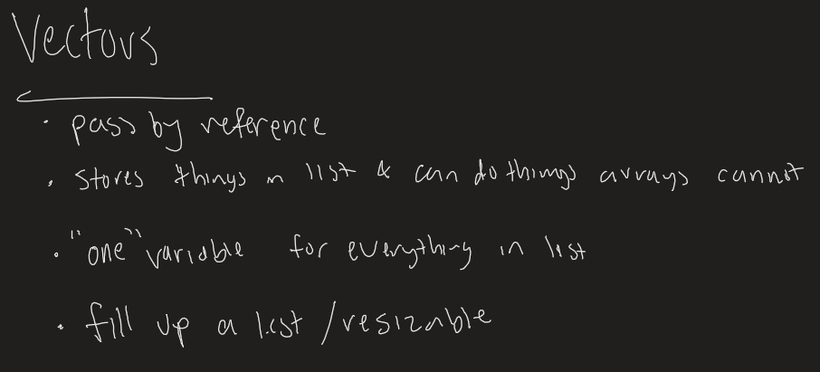

# Week 9

### Vectors
---
* List of data types (int, double, bool, etc.)
* Contains functions that can be used to iterate, modify, resize the list
    * Arrays can iterate and modify, **but** it *CANNOT* resize *easily*
* Vectors are part of the `<vector>` library
* Vectors can get extremely large; thus, passing by reference is highly recommended
* Vectors itself is technically a data type, which means that it can also be a return type for a function
* For now, vectors simply take up a block of memory, and increasing the size simply increases its memory block

* MW Session's One Thing

* TR Session's One Thing

#### Vector Functions
* at() - returns value at provided index
* size() - returns the size of the vector
* clear() - erases all elements and sets size to 0
* front() - returns the first element (index 0)
* back() - returns the last element (index size() - 1)
* resize() - resizes the vector to inputed number 
* push_back() - adds an element at the **end** of the vector
* pop_back() - removes an element at the **end** of the vector
* insert() - NOTE: function parameters are not the same as string's. This takes an iterator pointer (not yet learned) instead of an index number
* erase() - NOTE: function parameters are not the same as string's. This takes an iterator pointer (not yet learned) instead of an index number

### Vector Tracing/Walkthrough
---
* [WR's Tracing Doc](https://docs.google.com/document/d/10EZhO_22l2hLcbMx9_jCys77uz33TWRrR861aPMHKkk/edit?usp=sharing)
    * [Answers](https://repl.it/@PikaSannnnn/Vector-Tracing#main.cpp)

* More Walkthroughs/Tracings
    * [Basic (WIP)]()
    * [Moderate (WIP)]()
    * [Challenging (WIP)]()

* Coding Problems
    * [Basic](https://repl.it/@PikaSannnnn/W9b#main.cpp)
    * [Difficult](https://repl.it/@PikaSannnnn/W9d#main.cpp)
    * [EXTRA (WIP)](https://repl.it/@PikaSannnnn/W9e#main.cpp)